# NEXUS Architecture

## Overview

NEXUS is a Next.js 16 SaaS crypto intelligence platform that monitors blockchain transactions in real-time to identify whale activity, smart money movements, and significant on-chain events. It aggregates data from 17 external sources and serves it through a REST API, WebSocket streams, and a reactive frontend.

## System Architecture

```mermaid
graph TB
    subgraph "Client Layer"
        Browser["Browser / API Consumer"]
        WsClient["WebSocket Client"]
    end

    subgraph "Edge / Proxy"
        CFTunnel["Cloudflare Tunnel<br/>tracker.aitradepulse.com"]
    end

    subgraph "Application Layer"
        NextJS["Next.js 16 App Router<br/>Port 4400"]
        WSServer["Socket.IO Sidecar<br/>Port 4401"]
        Indexer["Blockchain Indexer<br/>Port 4409 (health)"]
    end

    subgraph "Data Layer"
        PG["PostgreSQL 16"]
        Redis["Redis 7<br/>Pub/Sub + Cache"]
    end

    subgraph "External Data Sources"
        RPC["Public RPC Nodes<br/>ETH / SOL / BTC / ARB / BASE / OP"]
        DeFiLlama["DeFiLlama<br/>TVL, Yields, DEX Volumes"]
        CoinPaprika["CoinPaprika<br/>50K+ Assets, Tickers"]
        GeckoTerminal["GeckoTerminal<br/>DEX Trending, OHLCV"]
        CryptoCompare["CryptoCompare<br/>News, Market Data"]
        LunarCrush["LunarCrush<br/>Social Sentiment"]
        CoinGecko["CoinGecko<br/>Market Prices"]
        DexScreener["DexScreener<br/>DEX Pair Data"]
        Polymarket["Polymarket<br/>Prediction Markets"]
        Blockstream["Blockstream<br/>Bitcoin Blockchain"]
        Reservoir["Reservoir<br/>NFT Data"]
        RSSFeeds["RSS Feeds<br/>30+ Crypto Sources"]
        FRED["FRED<br/>Macro Economics"]
        ExchangeRates["Exchange Rates API<br/>Forex"]
        Alchemy["Alchemy<br/>Enhanced RPC"]
        Helius["Helius<br/>Solana Enriched"]
        Etherscan["Etherscan<br/>Tx History"]
    end

    CFTunnel --> NextJS
    CFTunnel --> WSServer

    Browser --> CFTunnel
    WsClient --> CFTunnel

    NextJS --> PG
    NextJS --> Redis
    WSServer --> Redis
    Indexer --> PG
    Indexer --> Redis

    Indexer --> RPC
    Indexer --> DeFiLlama
    Indexer --> Alchemy
    Indexer --> Helius
    Indexer --> Etherscan

    NextJS --> DeFiLlama
    NextJS --> CoinPaprika
    NextJS --> GeckoTerminal
    NextJS --> CryptoCompare
    NextJS --> LunarCrush
    NextJS --> CoinGecko
    NextJS --> DexScreener
    NextJS --> Polymarket
    NextJS --> Blockstream
    NextJS --> Reservoir
    NextJS --> RSSFeeds
    NextJS --> FRED
    NextJS --> ExchangeRates
```



## Tech Stack

| Layer | Technology | Version |
|-------|-----------|---------|
| Framework | Next.js App Router | 16.2.6 |
| UI | React, Tailwind CSS 4, shadcn/ui, Recharts | React 19.2.4 |
| State | Zustand, TanStack Query, TanStack Table | — |
| ORM | Prisma | 6.19.3 |
| Database | PostgreSQL | 16 |
| Cache / Pub-Sub | Redis (ioredis) | 7 |
| Real-Time | Socket.IO | 4.8.3 |
| Auth | NextAuth.js (credentials provider) | 4.24.14 |
| Validation | Zod | 4.4.3 |
| Blockchain | viem, wagmi | — |
| Runtime | Node.js | 20+ |

## Services

### Web Application (`web`)

- **Port**: 4400
- **Role**: Serves the Next.js 16 App Router frontend and all `/api/v1/*` REST endpoints.
- **Auth**: NextAuth.js session-based for the UI; Bearer API key for programmatic access.
- **Middleware**: `src/middleware.ts` handles API key validation, rate limiting (in-memory per edge instance + Redis-backed per IP), usage tracking, and CORS.

### WebSocket Server (`ws`)

- **Port**: 4401
- **Role**: Real-time event delivery via Socket.IO. Subscribes to Redis Pub/Sub channels and fans out events to connected clients.
- **Namespaces**: `/trades`, `/alerts`, `/prices`, `/flows` — each with independent auth and room-based filtering.
- **Auth**: Bearer token validated against `NEXUS_API_KEYS`.
- **Files**: `ws-server/server.ts`, `ws-server/auth.ts`, `ws-server/subscriber.ts`

### Blockchain Indexer (`indexer`)

- **Port**: 4409 (HTTP health check only)
- **Role**: Multi-chain blockchain listener. Connects to EVM chains via WebSocket `eth_subscribe`, Solana via `accountSubscribe`, Bitcoin via Blockstream REST polling. Also runs periodic DeFiLlama and Etherscan sync jobs.
- **Chains**: Ethereum, Arbitrum, Base, Optimism, Solana, Bitcoin.
- **Publishing**: Decoded transactions and smart money signals are published to Redis Pub/Sub for the WS server to distribute.
- **Files**: `indexer/main.ts`, `indexer/chains/*.ts`, `indexer/processors/*.ts`, `indexer/integrations/*.ts`

## Data Flow

```
External APIs ──► Indexer (processors) ──► PostgreSQL ──► API Routes ──► Frontend
       │               │                      ▲
       │               └──► Redis Pub/Sub ────┘
       │                        │
       └────────────────► Next.js API Routes ──► Redis Cache ──► Frontend
                                         │
                                         └──► Socket.IO ──► WebSocket Clients
```

1. **Ingestion**: The indexer connects to blockchain RPC nodes and external APIs. Chain listeners decode raw transactions and apply smart money scoring.
2. **Storage**: Processed data is written to PostgreSQL via Prisma. The indexer maintains per-chain checkpoints (`IndexerCheckpoint`) for resumable sync.
3. **Distribution**: Events are published to Redis Pub/Sub channels. The WebSocket sidecar subscribes and fans out to connected clients. The Next.js API routes read from PostgreSQL with in-memory and Redis caching.
4. **Consumption**: The frontend fetches data via REST endpoints (with SWR-style polling) and receives real-time updates via Socket.IO.

## Architecture Patterns

### Circuit Breaker

`src/lib/circuit-breaker.ts` implements a server-side circuit breaker for external API calls and a client-side SWR hook with localStorage persistence.

- **States**: `ok` → `cooldown` → `degraded`
- **Server-side**: Wraps each external API client. After N consecutive failures, the breaker opens and returns cached data. After a cooldown period, it enters half-open state and allows a probe request.
- **Client-side**: `useSwrFetch()` provides stale-while-revalidate semantics with exponential backoff (1s–30s) and tab-pause (stops polling when the tab is hidden).

### Data Freshness Tracking

`src/lib/data-freshness.ts` tracks the age and health of each data source.

- **Thresholds**: Fresh (< 15 min), Stale (< 2 hours), Very Stale (< 6 hours), No Data.
- **Sources**: 14 tracked sources across DeFi, Pricing, DEX, Market, Social, Predictions, Bitcoin, NFT, and RPC categories.
- **Singleton**: `freshnessTracker` is the global instance used by the `/api/v1/data-sources` endpoint.

### Smart Polling

The frontend `useApi` hook (`src/lib/hooks/use-api.ts`) implements configurable refresh intervals per endpoint. The SWR hook (`useSwrFetch`) adds exponential backoff on failure and pauses when the browser tab is hidden to reduce unnecessary requests.

### Rate Limiting

Two layers:

1. **Middleware** (`src/middleware.ts`): In-memory, per-edge-instance rate limiting. 200 req/min per API key, 100 req/min for legacy routes.
2. **API routes** (`src/lib/api/rate-limit.ts`): Redis-backed sliding window. 100 req/min per IP using sorted sets with `ZREMRANGEBYSCORE` + `ZADD` + `ZCARD`.

### API Response Envelope

All v1 endpoints return a consistent shape via `src/lib/api/response.ts`:

```json
{
  "data": <T>,
  "meta": { "page": 1, "pageSize": 50, "total": 200, "hasMore": true },
  "error": null
}
```

Error responses:

```json
{
  "data": null,
  "error": "Human-readable error message"
}
```

## External Integrations (17 Data Sources)

### Always Free (No API Key)

| Source | Category | Use Case |
|--------|----------|----------|
| DeFiLlama | DeFi | TVL, yields, DEX volumes, stablecoins, bridges, fees |
| Jupiter | Pricing | Solana token pricing |
| CoinGecko | Market | Market data, prices |
| DexScreener | DEX | DEX pair data (300 req/min) |
| Blockstream | Bitcoin | Bitcoin blockchain data (blocks, tx, mempool) |
| Polymarket | Predictions | Prediction market data |
| Reservoir | NFT | NFT collections, sales, floor prices |
| GeckoTerminal | DEX | Trending pools, new pairs, OHLCV (260+ networks) |
| CoinPaprika | Market | 50K+ assets, tickers, global overview |
| RSS Feeds | News | 30+ curated crypto news feeds |
| FRED | Macro | GDP, CPI, interest rates, employment, yield curve |
| Exchange Rates | Forex | Major forex pairs (EUR/USD, GBP/USD, etc.) |

### Optional API Keys (Free Tiers)

| Source | Category | Free Tier | Use Case |
|--------|----------|-----------|----------|
| Alchemy | RPC | 30M CU/month | Token balances, transfers, NFT data, enhanced RPC |
| Helius | Solana | 100K credits/day | Enriched Solana transactions, DAS API, webhooks |
| Etherscan | Explorer | 5 calls/sec | Transaction history, gas prices, contract data |
| CryptoCompare | Market | Free tier | News articles, market data |
| LunarCrush | Social | Free tier | Social sentiment, Galaxy Score, Alt Rank |

## Database Schema

14 Prisma models across the intelligence stack:

| Model | Purpose |
|-------|---------|
| `Entity` | Tracked organizations (whales, funds, exchanges, protocols) |
| `Wallet` | Blockchain addresses linked to entities |
| `Token` | Tracked token metadata with price and flow data |
| `TokenHolding` | Wallet-to-token holdings with USD values |
| `Transaction` | Decoded on-chain transactions with smart money scoring |
| `SmartMoneyWallet` | Wallets flagged as smart money with category and score |
| `PredictionMarket` | Crypto prediction markets with yes/no prices |
| `PredictionTrade` | Individual trades in prediction markets |
| `Alert` | User-configured alert conditions |
| `DeFiProtocol` | DeFi protocol TVL, volume, and smart money inflow |
| `NFTCollection` | NFT collection floor price, volume, and wash trade score |
| `User` | Authentication and API key management |
| `IndexerCheckpoint` | Blockchain sync state per chain (resumable) |

## Project Structure

```
1ai-nexus/
├── src/
│   ├── app/                    # Next.js App Router
│   │   ├── (dashboard)/        # Dashboard layout group
│   │   ├── api/                # REST API routes
│   │   │   ├── v1/             # Versioned API (19 endpoints)
│   │   │   ├── alerts/         # Legacy alerts endpoint
│   │   │   ├── auth/           # NextAuth handler
│   │   │   ├── entities/       # Legacy entities
│   │   │   ├── predictions/    # Legacy predictions
│   │   │   └── ...
│   │   ├── alerts/             # Alert management page
│   │   ├── compare/            # Cross-market comparison
│   │   ├── dashboard/          # Main dashboard
│   │   ├── data-sources/       # Data source health page
│   │   ├── defi/               # DeFi protocol explorer
│   │   ├── entities/           # Entity explorer
│   │   ├── entity/[slug]/      # Entity detail page
│   │   ├── feeds/              # RSS feed aggregator
│   │   ├── fear-greed/         # Fear & Greed Index page
│   │   ├── flows/              # Capital flow visualization
│   │   ├── marketplace/        # NFT marketplace
│   │   ├── nft/                # NFT collection explorer
│   │   ├── portfolio/          # Portfolio tracker
│   │   ├── predictions/        # Prediction markets
│   │   ├── sectors/            # Crypto sector analysis
│   │   ├── smart-money/        # Smart money signals
│   │   ├── stablecoins/        # Stablecoin monitor
│   │   ├── terminal/           # Trading terminal
│   │   ├── token/[address]/    # Token detail page
│   │   ├── tokens/             # Token analytics
│   │   └── wallet/[address]/   # Wallet detail page
│   ├── components/
│   │   ├── compare/            # Cross-market comparison components
│   │   ├── defi/               # DeFi protocol components
│   │   ├── domain/             # Business domain components
│   │   ├── entity/             # Entity cards, graphs, tables
│   │   ├── layout/             # Layout shell (sidebar, header)
│   │   ├── predictions/        # Market cards, order books
│   │   ├── smart-money/        # Smart money signal components
│   │   ├── tokens/             # Token analytics components
│   │   └── ui/                 # Shared UI primitives (shadcn)
│   ├── lib/
│   │   ├── alerts/             # Alert engine (evaluator, delivery, schemas)
│   │   ├── api/                # API middleware (auth, rate-limit, response, validation)
│   │   ├── events/             # Redis event publisher and types
│   │   ├── hooks/              # React hooks (use-api)
│   │   ├── predictions/        # Prediction market mock data
│   │   ├── ws/                 # WebSocket client
│   │   ├── alchemy.ts          # Alchemy API client
│   │   ├── api-client.ts       # Frontend API client
│   │   ├── auth.ts             # NextAuth configuration
│   │   ├── circuit-breaker.ts  # Circuit breaker + SWR hook
│   │   ├── coinpaprika.ts      # CoinPaprika client
│   │   ├── cross-market.ts     # Cross-market data (forex, commodities, crypto)
│   │   ├── cryptocompare.ts    # CryptoCompare client
│   │   ├── data-freshness.ts   # Data freshness tracker
│   │   ├── db.ts               # Prisma client singleton
│   │   ├── defillama.ts        # DeFiLlama client
│   │   ├── etherscan.ts        # Etherscan client
│   │   ├── fred-client.ts      # FRED API client
│   │   ├── geckoterminal.ts    # GeckoTerminal client
│   │   ├── helius.ts           # Helius client
│   │   ├── lunarcrush.ts       # LunarCrush client
│   │   ├── mock-data.ts        # Development mock data
│   │   ├── redis.ts            # Redis client singleton
│   │   ├── rss-feeds.ts        # RSS feed aggregator (30+ feeds)
│   │   └── technical-analysis.ts # TA indicators (SMA, EMA, RSI, MACD, BB, ATR, VWAP, Stoch)
│   └── middleware.ts            # Next.js edge middleware (auth, rate-limit, CORS)
├── indexer/                     # Blockchain indexer (separate process)
│   ├── chains/                  # Chain-specific listeners
│   │   ├── ethereum.ts          # ETH/ARB/BASE/OP via eth_subscribe
│   │   ├── solana.ts            # SOL via accountSubscribe
│   │   └── bitcoin.ts           # BTC via Blockstream REST polling
│   ├── integrations/            # External API clients for indexer
│   │   ├── config.ts            # Centralized integration config
│   │   ├── http-client.ts       # HTTP client with retry + rate limiting
│   │   ├── alchemy.ts           # Alchemy enhanced APIs
│   │   ├── defillama.ts         # DeFiLlama sync jobs
│   │   ├── etherscan.ts         # Etherscan polling
│   │   └── jupiter.ts           # Jupiter pricing
│   ├── processors/              # Transaction decoding & smart money detection
│   │   ├── transaction.ts       # Transaction processor
│   │   └── smart-money.ts       # Smart money detection
│   ├── db.ts                    # Prisma client for indexer
│   ├── main.ts                  # Entry point + health server
│   ├── publisher.ts             # Redis event publisher
│   └── Dockerfile
├── ws-server/                   # WebSocket sidecar (separate process)
│   ├── server.ts                # Socket.IO server with namespaces
│   ├── auth.ts                  # Bearer token authentication
│   ├── subscriber.ts            # Redis event subscriber
│   └── Dockerfile
├── prisma/
│   ├── schema.prisma            # Database schema (14 models)
│   └── seed.ts                  # Seed script (50 entities, 500 markets)
├── docker-compose.yml           # Unified Docker Compose (6 services)
└── Dockerfile                   # Multi-stage build (deps → builder → runner)
```

## Deployment

### Production

- **Domain**: `tracker.aitradepulse.com`
- **Tunnel**: Cloudflare Tunnel routes traffic to the Docker Compose stack.
- **Services**: `postgres` (5432), `redis` (6379), `web` (4400), `ws` (4401), `indexer` (4409 health), `db-init` (one-shot seed).

### Docker Compose

```bash
docker compose up -d
```

The `db-init` service runs schema push + seed once, then exits. All application services depend on it completing successfully.
